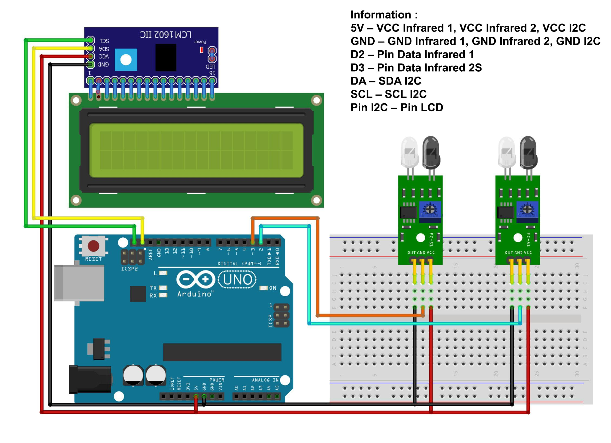

# Parking Space Counter with Arduino and LCD

This project implements a parking space counter using an Arduino and an LCD display. The system detects vehicles entering and exiting a parking area and updates the available parking spaces on the LCD.

## Components Used

- Arduino IDE or Code Editor --> VS Code;
- Library: LiquidCrystal_I2C;
- Arduino Uno = 1 piece;
- LiquidCrystal_I2C LCD with I2C(16x2) = 1 piece;
- Infrared sensors {IR Obstacle Sensor} = (2 units);
- Project Board / BreadBoard = 1 piece;
- Resistors and jumper wires;

# Schematic:

- Below you can see a schematic image to facilitate the wiring of cables from the microcontroller to devices, both input and output sensors:

## Wiring Diagram

- Connect the `Sensor_Masuk` to digital pin D2 on the Arduino.
- Connect the `Sensor_Keluar` to digital pin D3 on the Arduino.
- Wire the LiquidCrystal_I2C LCD to the Arduino according to standard I2C connections (SDA to A4, SCL to A5 on Arduino Uno).

## Work steps

- Prepare the tools and materials to be used.
- Carry out the wiring process using Figure schematic of the above circuit.
- Open the Arduino IDE software that has been installed on laptop/computer.
- Download all the libraries above and insert the library by opening the Arduino IDE, selecting Sketch > Include Library -> Add.Zip Library.
- Type the sketch program on the Arduino IDE page.
- Enter the I2C LCD address in the sketch program.
- Carry out the program uploading process.

## How It Works

- The system uses two infrared sensors: one to detect vehicles entering and another for exiting.
- The number of available parking spaces is stored in a variable `Jumlah_Ruang` and initialized to 400.
- When a vehicle enters, the sensor triggers and decreases the count of available spaces.
- When a vehicle exits, the count is increased.
- The current number of available spaces is displayed on the LCD.

## Code Explanation

- The LCD is initialized using the `LiquidCrystal_I2C` library with address `0x27` and a 16x2 display configuration.
- The `loop()` function continuously checks the state of the sensors and updates the `Jumlah_Ruang` variable accordingly.
- The number of available parking spaces is displayed on the LCD, which refreshes every 200 milliseconds.

## Installation

1. Connect the components as described in the wiring diagram.
2. Upload the provided code to the Arduino using the Arduino IDE.
3. Ensure the LCD is properly connected and powered.

## Usage

- Monitor the LCD display to see the number of available parking spaces.
- Adjust the initial value of `Jumlah_Ruang` as needed based on the actual parking capacity.

## Conclusion:

- The program works by detecting the presence of objects passes through an infrared sensor. When an object passes by infrared sensor 1 (entry), then the parking space will be reduced by one from the amount that has been entered, then when an object passes through infrared 2 (out) then the parking space will increase by one according to the number that has been entered.

#### @Copyright 2024 | Car-Parking-Spot-Remainder-Counter
